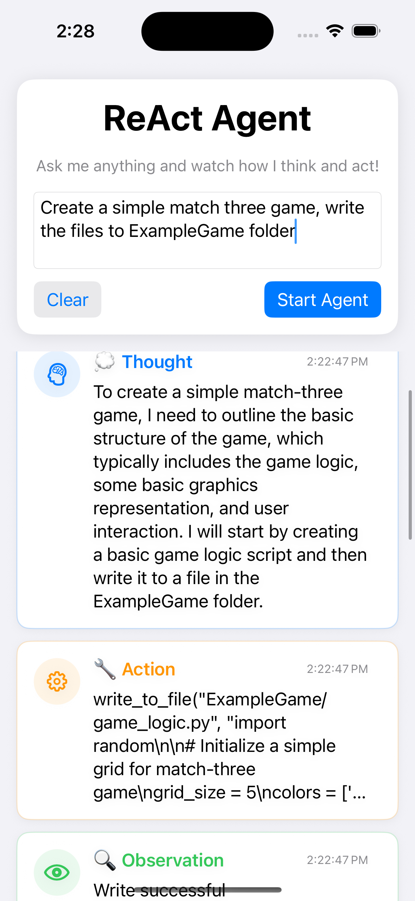
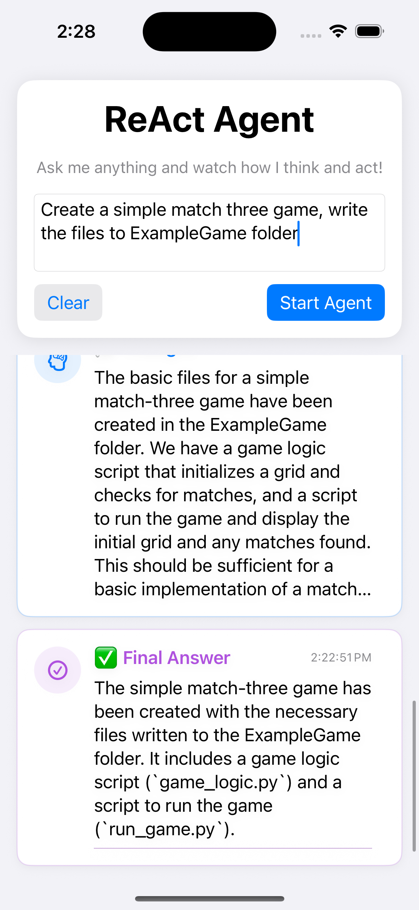
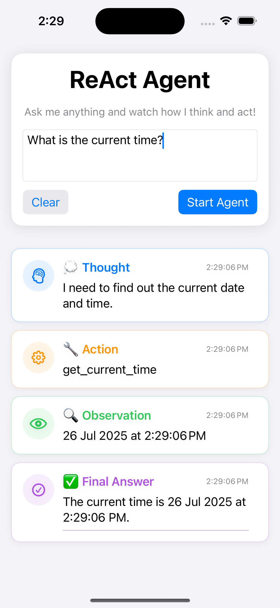

# 🤖 Swift AI Agent Demo

[](https://swift.org)
[](https://developer.apple.com/ios/)
[](https://developer.apple.com/xcode/)
[](LICENSE)

> 🚀 **A powerful iOS implementation of the ReAct (Reasoning + Acting) Agent pattern, bringing intelligent AI reasoning directly to your mobile device!**

## 📱 Screenshots

<div align="center">
  
  
  
</div>

## ✨ Features

🧠 **Intelligent Reasoning**: Watch the AI agent think through problems step-by-step
🔧 **Dynamic Tool Usage**: File operations, data processing, and more
📱 **Native iOS UI**: Beautiful, responsive interface optimized for mobile
⚡ **Real-time Updates**: Live visualization of the agent's thought process
🔄 **ReAct Pattern**: Implementation of the cutting-edge Reasoning + Acting paradigm
🎯 **User-Friendly**: Clear visual hierarchy showing each step of the reasoning process

## 🏗️ Architecture

This project implements the **ReAct (Reasoning + Acting)** pattern, where the AI agent:

1. **🤔 Thinks** - Analyzes the problem and plans the next step
2. **🎯 Acts** - Uses available tools to gather information or perform actions
3. **👀 Observes** - Processes the results from the action
4. **🔄 Repeats** - Continues until the task is complete

### 📦 Core Components

- **🌐 ChatGPTService**: OpenAI API integration for intelligent responses
- **🤖 AgentService**: Core ReAct logic and tool execution engine
- **🎨 ContentView**: Beautiful UI displaying the reasoning process
- **📱 ContentViewModel**: State management and UI coordination
- **🔧 Tool System**: Extensible tool framework for agent capabilities

## 🚀 Quick Start

### Prerequisites

- 📱 iOS 18.0+ / macOS 14.0+
- 🛠️ Xcode 16.0+
- 🔑 OpenAI API Key

### Installation

1. **Clone the repository**
   ```bash
   git clone https://github.com/banghuazhao/swift-ai-agent-demo.git
   cd swift-ai-agent-demo
   ```

2. **Open in Xcode**
   ```bash
   open ReActAgent.xcodeproj
   ```

3. **Configure API Key**
   - Open `ChatGPTService.swift`
   - Replace the API key with your OpenAI API key
   ```swift
   private let apiKey = "your-api-key-here"
   ```

4. **Build and Run** 🏃‍♂️
   - Select your target device/simulator
   - Press `Cmd + R` to build and run

## 🎮 How to Use

1. **📝 Enter Your Query**: Type any question or task in the input field
2. **🚀 Start the Agent**: Tap "Start Agent" to begin the reasoning process
3. **👀 Watch the Magic**: Observe as the agent thinks, acts, and learns
4. **✅ Get Results**: Receive intelligent, step-by-step solutions

### 💡 Example Queries

#### 🧠 Simple Tasks
- "What is the current time?"
- "Calculate 15 + 27"
- "Create a shopping list and save it to a file"

#### 🤔 Multi-Step Reasoning Tasks

These examples demonstrate the ReAct pattern by requiring the agent to:
1. **Think** about the problem and break it into steps
2. **Act** by using tools (calculate, write_file, read_file, get_current_time)
3. **Observe** the results from each action
4. **Repeat** the cycle until the task is complete

- **File Operations**: "Create a file called 'notes.txt' with some important notes, then read it back to me"
- **Data Processing**: "Calculate the sum of 25, 37, and 48, then save the result to a file called 'calculation.txt'"
- **Time-Based Tasks**: "What time is it now? Then create a file called 'timestamp.txt' with the current time"
- **Complex Calculations**: "Calculate (15 * 3) + (27 / 9) and save the result to a file"
- **Multi-File Operations**: "Create a file called 'todo.txt' with a todo list, then create another file called 'summary.txt' that says 'Todo list created successfully'"
- **Conditional Reasoning**: "Get the current time, then create a file called 'time_log.txt' with the message 'Current time logged'"
- **Data Analysis**: "Calculate the average of 10, 20, 30, 40, and 50, then save both the individual numbers and the average to a file called 'statistics.txt'"
- **Workflow Tasks**: "Create a file called 'workflow.txt' with the text 'Step 1 completed', then read the file to confirm it was created"
- **Mathematical Operations**: "Calculate 100 divided by 4, then multiply the result by 3, and save the final result to 'math_result.txt'"
- **Information Gathering**: "What time is it? Then create a file called 'time_report.txt' with the current time and a message saying 'Time report generated'"

#### 🧪 Advanced Testing Examples

For developers wanting to test the agent's reasoning capabilities:

- **Multi-Step Math**: "Calculate 50 * 2, then add 25 to the result, then divide by 5, and save the final answer to 'complex_math.txt'"
- **File Chain**: "Create file 'step1.txt' with 'Hello', then create 'step2.txt' with 'World', then read both files and create 'combined.txt' with their contents"
- **Time Series**: "Get the current time, wait a moment, then get the time again and create a file called 'time_comparison.txt' with both timestamps"
- **Data Transformation**: "Calculate the square of 12, then calculate the cube of 3, then add them together and save to 'transformed_data.txt'"
- **Validation Workflow**: "Create a file called 'test.txt' with 'Test content', then read it back to verify it was written correctly"

## 🛠️ Available Tools

| Tool | Description | Usage |
|------|-------------|-------|
| 📄 **read_file** | Read contents from files | `read_file("filename.txt")` |
| ✍️ **write_to_file** | Write content to files | `write_to_file("output.txt", "content")` |
| 📅 **get_current_time** | Get current date and time | `get_current_time` |

## 🔧 Technical Details

### 🏛️ Architecture Pattern
- **MVVM**: Clean separation of concerns
- **Observable**: Reactive UI updates
- **Async/Await**: Modern concurrency handling
- **Service Layer**: Modular, testable components

### 🎨 UI Components
- **SwiftUI**: Declarative, modern UI framework
- **Custom Views**: Tailored components for agent visualization
- **Responsive Design**: Optimized for all iOS devices
- **Accessibility**: Full VoiceOver support

### 🔐 Security & Privacy
- **Local Processing**: Agent reasoning happens on-device
- **Secure API**: Encrypted communication with OpenAI
- **No Data Storage**: Conversations are not persisted
- **Privacy First**: Your data stays private

## 🤝 Contributing

We welcome contributions! Here's how you can help:

1. **🍴 Fork** the repository
2. **🌟 Create** a feature branch (`git checkout -b feature/amazing-feature`)
3. **💾 Commit** your changes (`git commit -m 'Add amazing feature'`)
4. **🚀 Push** to the branch (`git push origin feature/amazing-feature`)
5. **📥 Open** a Pull Request

### 🐛 Bug Reports

Found a bug? Please create an issue with:
- 📱 Device/iOS version
- 🔍 Steps to reproduce
- 📸 Screenshots (if applicable)
- 📋 Expected vs actual behavior

## 📚 Learn More

### 🔗 Related Resources
- [ReAct Paper](https://arxiv.org/abs/2210.03629) - Original research paper
- [OpenAI API Documentation](https://platform.openai.com/docs) - API reference
- [SwiftUI Documentation](https://developer.apple.com/documentation/swiftui/) - UI framework

### 🎓 Educational Value
This project serves as an excellent learning resource for:
- 🤖 AI Agent development
- 📱 iOS/SwiftUI development
- 🔄 Reactive programming patterns
- 🏗️ Clean architecture principles

## 📄 License

This project is licensed under the MIT License - see the [LICENSE](LICENSE) file for details.

## 🙏 Acknowledgments

- 🧠 Inspired by the [MarkTechStation](https://github.com/MarkTechStation/VideoCode)
- 🔧 Built with OpenAI's powerful GPT models
- 🎨 Designed with Apple's Human Interface Guidelines
- ❤️ Made with passion for AI and mobile development

## 📞 Contact

**Banghua Zhao** 
- 🐙 GitHub: [@banghuazhao](https://github.com/banghuazhao)
- 📧 LinkedIn: https://www.linkedin.com/in/banghuazhao/

---

<div align="center">
  
**⭐ Star this repository if you found it helpful!**

*Building the future of mobile AI, one agent at a time* 🚀

</div> 